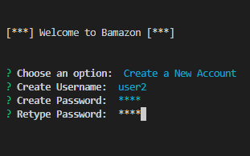
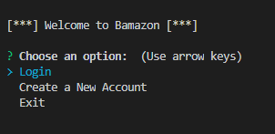
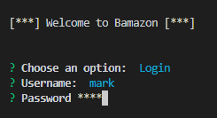
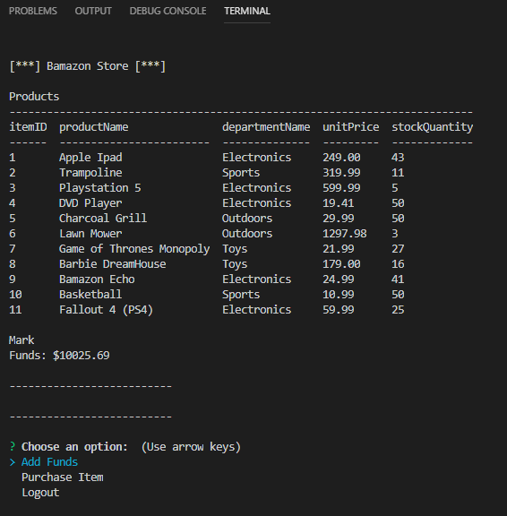

<h1 align="center">Welcome to Bamazon </h1>
<p>
  
  <a href="https://github.com/MRBruce9866/bamazon#readme">
    
  </a>
  <a href="https://github.com/MRBruce9866/bamazon/graphs/commit-activity">
    
  </a>
  <a href="https://github.com/MRBruce9866/bamazon/blob/master/LICENSE">
    
  </a>
</p>

> Bamazon is a node application designed to mimic an Amazon type app that pulls data from a database server (in this case, MySql) and allows the user to interact with the server in various ways. The customer can login, add funds to their account, and make purchases. An admin can login, view and update the current stock of products for sale, and even add new products to sell. 

### 🏠 [Homepage](https://github.com/MRBruce9866/bamazon#readme)

## Install

```sh
npm install
```

## Usage

```sh
node bamazon.js
```

## Alternative Start

```sh
npm run start
```

## Screen Shots
```sh
Create a New Account
```



```sh
Login
```

  


 


## Author

👤 **Markus Bruce**

* Github: [@MRBruce9866](https://github.com/MRBruce9866)

## 🤝 Contributing

Contributions, issues and feature requests are welcome!<br />Feel free to check [issues page](https://github.com/MRBruce9866/bamazon/issues).

## Show your support

Give a ⭐️ if this project helped you!

## 📝 License

Copyright © 2019 [Markus Bruce](https://github.com/MRBruce9866).<br />
This project is [ISC](https://github.com/MRBruce9866/bamazon/blob/master/LICENSE) licensed.

***
_This README was generated with ❤️ by [readme-md-generator](https://github.com/kefranabg/readme-md-generator)_